```jsonc
// GET zingico.com/api/daniel — 200 OK
{
  "role":     "fullstack developer — apprentice @ Visma",
  "based":    "Norway",
  "daylight": ["C#", ".NET", "Angular"],       // the work stack
  "midnight": ["TypeScript", "Vue", "Rust"],   // my stack
  "belief":   "I create because I have to"
}
```

### `$ curl -s zingico.com/api/projects`

`200 OK` — [**zingico.com**](https://zingico.com) · the portfolio itself. Vue 3 + Rust/Axum, self-hosted, oversecured for sport, Lighthouse chased into the 100s.\
`201 Created` — **jira-mcp** · an MCP server for Jira/Confluence that colleagues at Visma run daily. Private, for now.\
`200 OK` — [**Aranea Rete**](https://github.com/DanielOM999/Aranea-Rete) · a TF-IDF web search engine that respects robots.txt.\
`200 OK` — [**KLP Bank**](https://github.com/DanielOM999/KLP-bank) · banking prototype — accounts, transactions, financial viz.\
`410 Gone` — **SwiftBinder** · large-file storage & sharing. Deprecated. Lessons extracted.

### `$ tail -f /var/log/now.log`

```log
[ ok ] shipping C#/.NET + Angular on a welfare platform at Visma, by day
[ ok ] rebuilding my corner of the internet in Rust, by night
[ ok ] hunting the last Lighthouse point on zingico.com
[ .. ] teaching a terminal-themed portfolio to explain itself to non-devs
```

### `$ echo $CONTACT`

Everything worth seeing lives at [**zingico.com**](https://zingico.com) — it has an uptime counter that has been running since the day I was born.

<sub><code>daniel@zingico:~$ exit</code> · connection to zingico closed.</sub>
