```diff
@@ 2024 → 2026 @@
- vocational IT student — tutorials, prototypes, first experiments
+ fullstack developer on Visma Flyt — welfare tech that municipalities across Norway rely on
+ designer & builder of production software people use every day
```

### `$ cat ~/highlights`

| | | |
|---|---|---|
| **[InSchool help center](https://inschool.zendesk.com/hc/no)** | `in production` | Redesigned end-to-end — Figma drafts, user conversations, stakeholder reviews, new Zendesk theme built from scratch |
| **Visma Flyt** | `my day job` | Fullstack on the welfare platform Norwegian municipalities rely on — where there's chaos, we help |
| **jira-mcp** | `used daily` | MCP server for Jira/Confluence I built on my own initiative — colleagues across Visma run it |
| **Ungdomsbedrift** | `~1,500 users` | Wrote all the code for our student company's product; 3rd in the vocational category at the county championship |
| **[zingico.com](https://zingico.com)** | `self-hosted` | Vue 3 + Rust/Axum + MySQL/Redis behind nginx — mine from Figma to server |

### `$ git status`

```
On branch now
Changes not staged for commit:
        modified:   zingico.com    → building it into a community, not just a portfolio
        modified:   open-source    → moving more of my private work into the open
        modified:   craft          → going deeper on rust, design, and systems that last
```

### `$ ls ~/toolbox`

```
languages   TypeScript · C# · Rust · Python · SQL
frontend    Vue 3 · Angular · Tailwind · Vite
backend     .NET · Axum · Node/Express · MySQL/Postgres · Redis
infra       Docker · nginx · GitHub Actions · MinIO/S3 · OpenTelemetry
design      Figma · Blender · Adobe Illustrator/Photoshop/Premiere
```

### `$ ls ~/public`

[**aranea-rete**](https://github.com/daniel-mostad/Aranea-Rete) — TF-IDF web search engine in Node/TS/Postgres, with polite crawling\
[**klp-bank**](https://github.com/daniel-mostad/KLP-bank) — banking prototype: accounts, transactions, financial visualization\
[**vpn---python**](https://github.com/daniel-mostad/VPN---Python) — a VPN from scratch, to understand tunneling instead of trusting it\
[**rabbidisc**](https://github.com/daniel-mostad/RabbiDisc) — bluetooth device discovery and tracking with python/bleak

<sub>The newest work lives in private repos — a family of Chrome extensions is headed for public releases.</sub>

<!--fortune-->

<!--/fortune-->

Open to collaborating — especially on web platforms, developer tooling, and design-heavy frontends. Reach me through [**zingico.com**](https://zingico.com), where the full experience lives.

<sub><code>0000001 (root-commit)</code> — I create because I have to.</sub>
